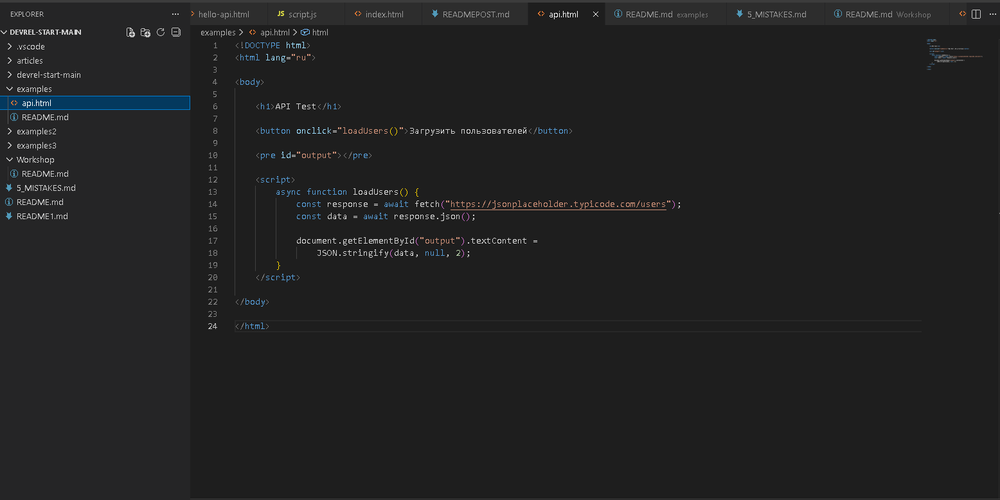
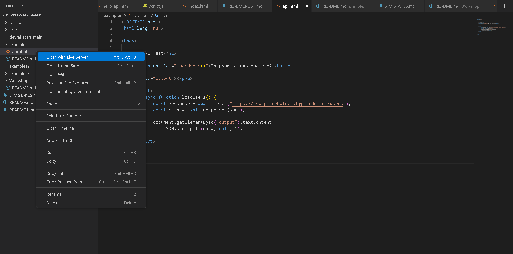

## Examples

All usage examples are located in the examples/ folder.

### API example

Steps to run:

1. Open the examples folder
2. Open api.html
3. Run it using Live Server  
   or simply open the file in a browser
4. Click the "Load users" button

You should see a JSON response from the API. 

## Demo Video 

🎥 How to run the API example:
https://www.youtube.com/watch?v=FHGQwv7zJdQ

